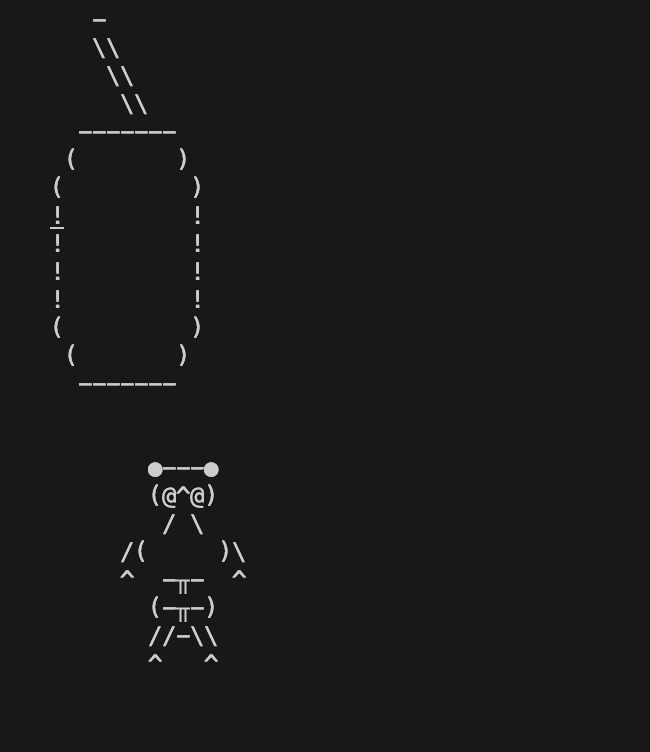
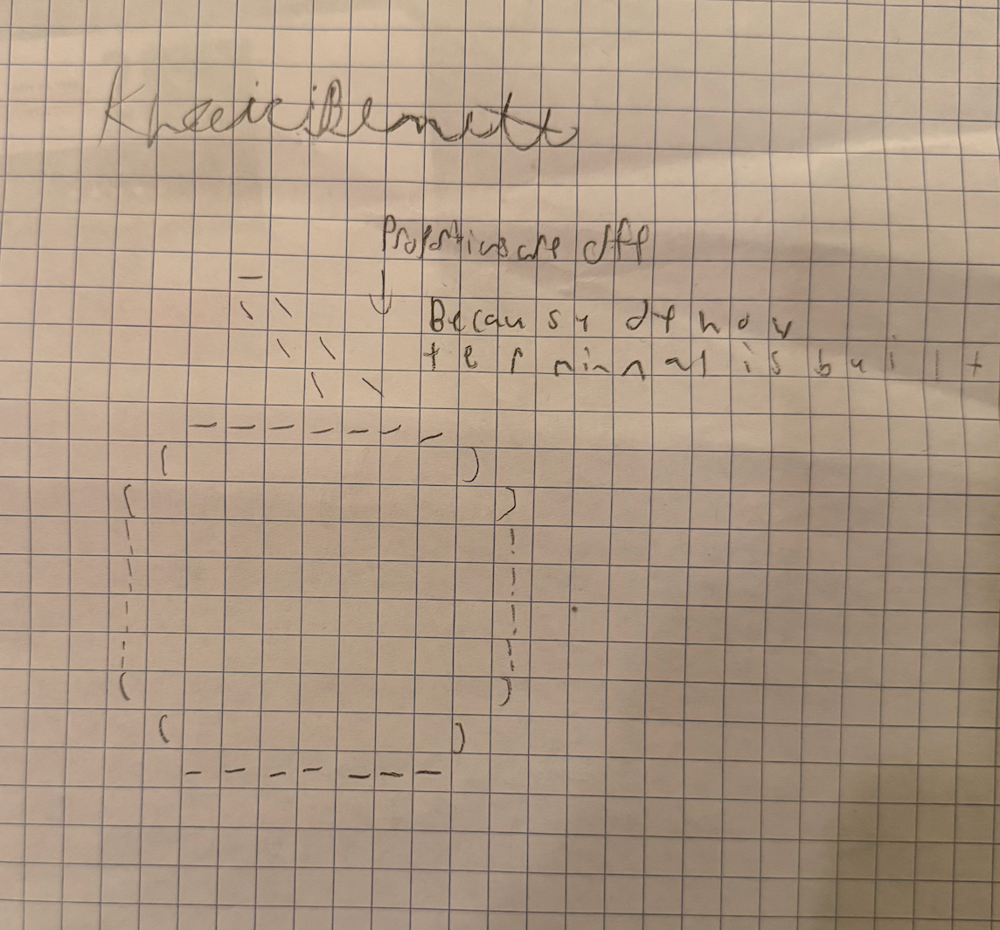
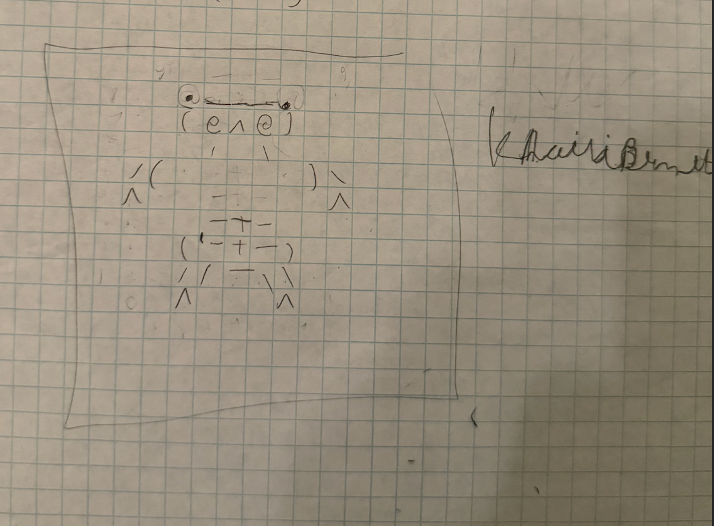

# scroll-art
My ascii-art are in ascii2 and both my mouse looking ascii art and my soda can with a stray were both selfmade. My mouse ascii was 9x9 while my soda can was 14x14. 
here are both my mouse and soda can: 

Process of making the art:

First I created a rough skecth on graph paper even knowing that if I made it in the boxes it would look slimer on terminal.
the soda can: 

the mouse: 

then for each drawing I manually put each individual character into 2D arrays getsoda(); and getmouse(); respectively 